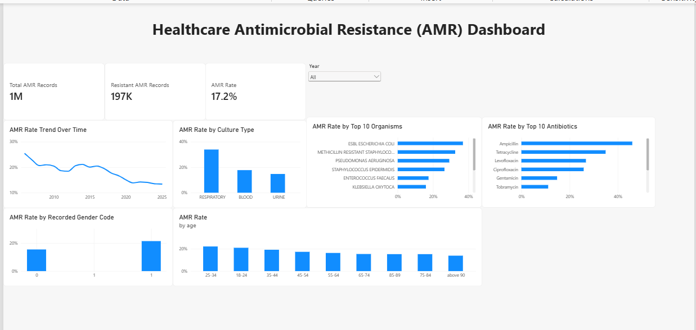
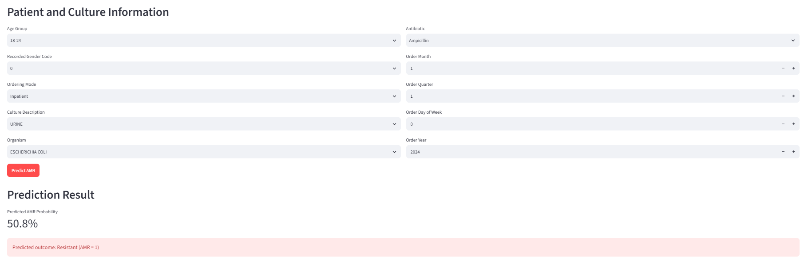

# Healthcare Data Analytics and Antimicrobial Resistance Prediction

An end-to-end healthcare analytics and machine learning project analyzing antimicrobial resistance (AMR) patterns using de-identified microbiology data.

## Project Overview

Antimicrobial resistance is an important healthcare challenge. This project analyzes microbiology culture and antibiotic susceptibility data to:

- quantify antimicrobial resistance patterns
- analyze organisms, antibiotics, and culture types
- examine demographic and temporal patterns
- define and prepare an AMR prediction dataset
- build and evaluate a machine learning model
- interpret model behavior using explainability methods
- communicate findings through an interactive Power BI dashboard
- demonstrate a Streamlit prediction interface

The project follows a complete healthcare data workflow from raw data inspection and cleaning through analytics, machine learning, explainability, visualization, and documentation.

## Dataset

**Dataset:** Antimicrobial Resistance Microbiological Dataset — University of Texas Southwestern (ARMD-UTSW)

**Source:** Dryad

The dataset contains de-identified longitudinal microbiology and clinical information, including culture orders, organisms, antibiotics, susceptibility results, demographics, and temporal information.

Due to the size and data-sharing considerations, the raw dataset is **not included in this repository**.

## AMR Definition

For the primary analysis and prediction task:

- `AMR = 1` → Resistant
- `AMR = 0` → Susceptible

Records classified as Intermediate, Inconclusive, or missing susceptibility were excluded from the binary AMR modeling dataset.

The final modeling dataset contained:

- **1,146,274** susceptibility records
- **949,098** Susceptible records
- **197,176** Resistant records
- **17.2%** overall resistance rate
- **45,056** unique patients
- **86,136** culture orders
- **386** organisms
- **75** antibiotics

## Data Architecture

The raw microbiology data was treated at the following analytical grain:

**Patient → Encounter → Culture Order → Organism → Antibiotic → Susceptibility Outcome**

A single culture order can contain multiple organisms and multiple antibiotic susceptibility records. Therefore, the raw dataset was not treated as a simple one-row-per-culture table.

## Analytics Workflow

### 1. Data Engineering

- Dataset structure inspection
- Data type validation
- Missing-value handling
- Duplicate investigation
- Data consistency checks
- Date/time processing
- Analytical dataset construction
- Feature engineering

### 2. SQL Analytics

Healthcare analytics were designed around:

- infection burden
- organism distribution
- antibiotic resistance
- AMR rates and denominators
- patient and clinical characteristics
- CTEs
- window functions
- temporal analysis

### 3. Statistical Analysis

The project incorporates:

- descriptive statistics
- distribution analysis
- confidence intervals
- hypothesis testing
- chi-square / Fisher's exact testing
- t-tests / Mann–Whitney testing
- correlation analysis
- logistic regression for association
- odds-ratio interpretation

### 4. Exploratory Data Analysis

Analysis includes:

- infection patterns
- organism patterns
- antibiotic resistance patterns
- AMR by demographic characteristics
- AMR by healthcare exposure where available
- temporal AMR trends

## Machine Learning

The prediction task was designed around information available before the final susceptibility outcome, with explicit attention to potential data leakage.

Models explored include:

- Logistic Regression
- Random Forest
- XGBoost

The primary documented model is a Logistic Regression pipeline using categorical encoding and standardized numeric features.

Because resistant cases represented approximately 17% of the modeling dataset, model performance was evaluated using metrics beyond accuracy.

### Evaluation Metrics

- Accuracy
- Precision
- Recall / Sensitivity
- Specificity
- F1-score
- ROC-AUC
- PR-AUC
- Brier score
- Calibration
- Confusion matrix
- Error analysis
- Temporal validation

## Model Results

The evaluated Logistic Regression model demonstrated a trade-off between sensitivity and false-positive rate.

On the evaluated test set at the selected decision threshold:

| Metric | Result |
|---|---:|
| Accuracy | 0.551 |
| Precision | 0.261 |
| Recall / Sensitivity | 0.814 |
| F1-score | 0.395 |
| ROC-AUC | 0.702 |
| PR-AUC | 0.307 |
| Specificity | 0.493 |
| Brier score | 0.145 |

These results are reported as observed model performance and should not be interpreted as clinical validation.

The model is a portfolio/research demonstration and is **not intended for clinical decision-making**.

## Explainable AI

Model interpretation was performed using:

- permutation importance
- SHAP
- global feature importance analysis
- individual prediction interpretation

Important features included variables related to culture type, antibiotic, organism, time, and demographic coding.

Feature importance represents model behavior and association. It does **not establish causal relationships**.

## Power BI Dashboard



An interactive Power BI dashboard was developed to communicate AMR patterns.

The dashboard includes:

- Total AMR records
- Resistant records
- Overall AMR rate
- AMR rate by organism
- AMR rate by antibiotic
- AMR trends over time
- AMR by culture type
- AMR by recorded gender code
- AMR by age group
- year filtering

The dashboard uses the processed analytical dataset generated from the project workflow.

## Streamlit Application

A Streamlit interface was developed to demonstrate how the saved machine learning pipeline can be used to generate an AMR prediction from selected input characteristics.

The application is intended as a technical demonstration rather than a clinical prediction system.

The project includes a Streamlit interface for demonstrating the trained AMR prediction pipeline.



The application accepts patient and culture-related inputs and returns a model-generated AMR probability and predicted outcome. This interface is intended as a portfolio prototype and not for clinical decision-making.

## Key Insights from AMR Analysis

- AMR rate observed at ~17% across dataset
- Certain organisms (e.g., E. coli) show higher observed resistance rates
- Some antibiotics, including Ampicillin and Tetracycline, show higher observed resistance rates
- AMR trends show variation across years and patient demographics

## Skills Demonstrated

- Data Cleaning & Preprocessing (large healthcare dataset)
- Feature Engineering (categorical encoding, temporal features)
- Machine Learning (Logistic Regression, pipeline design)
- Model Deployment (Streamlit)
- Data Visualization (Power BI)
- Version Control (Git, GitHub)

## Data Privacy and Ethics

The source dataset is de-identified.

This project does not attempt to identify individuals or reconstruct identifying information.

Important considerations include:

- anonymized identifiers are used only for analytical grouping/splitting
- raw patient-level data is not included in this repository
- gender codes are retained as recorded because the dataset documentation does not disclose their mapping
- dates are de-identified/jittered
- model outputs should not be interpreted as causal effects
- the model should not be used for clinical decision-making

Further details are available in:

- `reports/data_and_ethics.md`
- `reports/model_card.md`

## Limitations

Important limitations include:

- the dataset is de-identified
- dates are jittered
- some potentially useful clinical variables are not available in the selected files
- prior antibiotic exposure is not directly available in the selected dataset
- the prediction task therefore cannot claim to represent every clinical risk factor
- the exact clinical prediction point for some microbiology-derived variables requires careful interpretation because the selected files do not provide complete treatment-history or pre-test clinical context
- class imbalance affects classification performance
- threshold selection changes the precision/recall trade-off
- temporal validation requires careful separation of training, threshold-selection, and final test periods
- observed model associations should not be interpreted as causal relationships

## Project Structure

```text
healthcare-amr-analytics/
│
├── app.py
├── requirements.txt
├── .gitignore
│
├── data/
│   ├── raw/
│   └── processed/
│
├── models/
│   ├── amr_prediction_pipeline.joblib
│   └── logistic_model.joblib
│
├── notebooks/
│   └── 01_dataset_inspection.ipynb
│
├── reports/
│   ├── PowerBi/
│   │   └── Healthcare_AMR_Dashboard.pbix
│   ├── data_and_ethics.md
│   └── model_card.md
│
└── src/
    ├── __init__.py
    ├── analysis.py
    ├── config.py
    ├── data_processing.py
    ├── feature_engineering.py
    └── model_pipeline.py